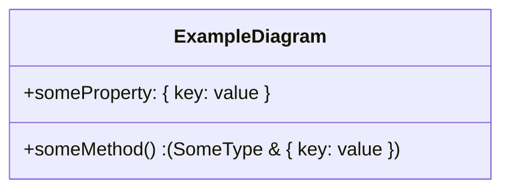

Mermaid の Class Diagram 上で object literal の型を書くとき、そのまま `{ key: value }` と記述するとエラーになります。

```txt
これだとエラーになる...

classDiagram
  class ErrorDiagram {
    +someProperty: { key: value }
    +someMethod() { key: value }
  }
```

Mermaid では Entity Code での記述がサポートされているのでこの機能を使うことで object literal を記述することができます。



上記の図は次のように記述しています。プロパティの定義だと問題なく描画されますが、メソッドの返り値で記述すると描画されなかったため括弧で囲みコロンも明示的に記述しています。（本来だと返り値のコロンは自動で挿入される）

```txt
classDiagram
  class ExampleDiagram {
    +someProperty: #0123; key: value #0125;
    +someMethod() : (SomeType & #0123; key: value #0125;)
  }
```
